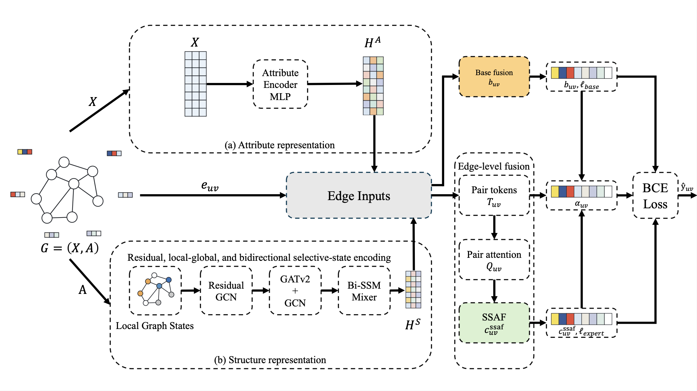

# ASLAM-SSAF

## Introduction

This project focuses on link prediction, a fundamental task in graph representation learning with broad applications in citation analysis, recommendation systems, social network mining, biological network modeling, and Internet of Things communication analysis. To address the limitations of existing attribute-structure collaborative methods, including insufficient multi-scale structural modeling, shallow edge-level interaction, and limited control over enhanced modules, the project proposes ASLAM-SSAF, a selective state-space attention fusion framework.

ASLAM-SSAF enhances the structural branch through residual graph convolution, a dual GATv2–GCN structural encoder, and a lightweight bidirectional selective-scan-style mixer. For each candidate edge, the model constructs pair-token sequences using attribute endpoints, structural endpoints, branch summaries, cross-branch discrepancy statistics, endpoint-mean statistics, and heuristic priors. These tokens are then processed through attention-based and state-space-inspired fusion modules. In addition, an edge-wise adaptive gate is introduced to dynamically balance the stable base path and the enhanced expert path, improving both prediction performance and model robustness.

Under the retained five-dataset local evaluation protocol, ASLAM-SSAF improves the average AUC from 0.9469 to 0.9525 and the average AP from 0.9505 to 0.9573 compared with the local ASLAM baseline. It also ranks first in the corresponding 13-model local comparison. Ablation studies, training dynamics, t-SNE visualizations, and a supplementary NF-BoT-IoT communication-graph case study further demonstrate the effectiveness of multi-scale structural enhancement and selective state-space attention fusion within the bounded evaluation setting.

## Model Architecture



## Citation

If you find this project useful in your research, please cite our paper:

```bibtex
@misc{aslam_ssaf_2026,
  title={ASLAM-SSAF: Selective State-Space Attention Fusion for Attribute-Structure Collaborative Link Prediction},
  author={Wei Yu, Xinyu Lu, Jingyao Zhang, Chaoyang Pan, Yaqi Gao, Yuhan Zhao},
  year={2026},
  note={Manuscript under review}
}
